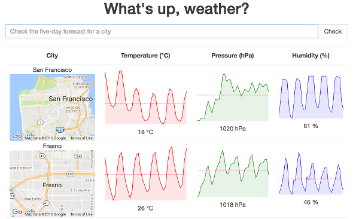

# Weather Sup

Find out how the weather is going to be like over the course of five days.



## Installation

Install all module dependencies using npm:

```
npm install
```

Run the webpack development server using:

```
npm start
```

The app will be available at <http://localhost:8080>
